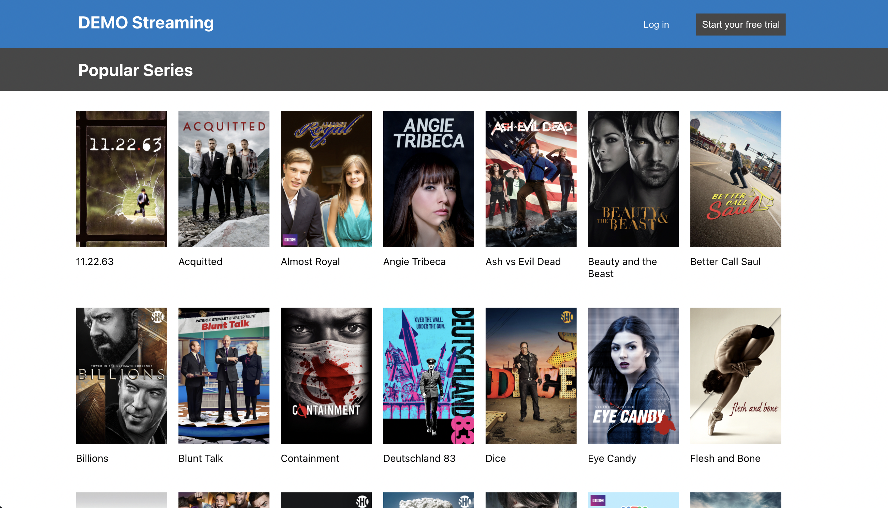
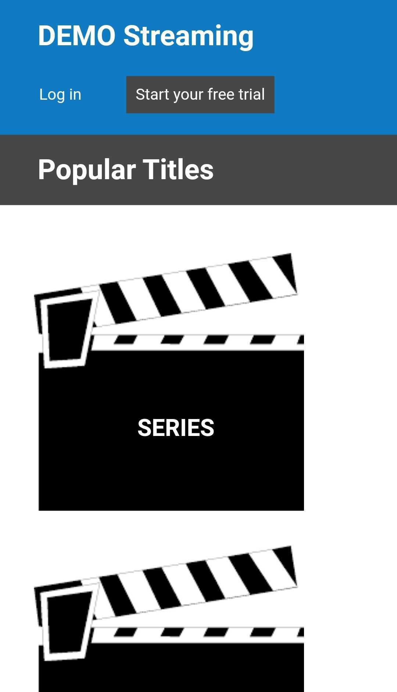
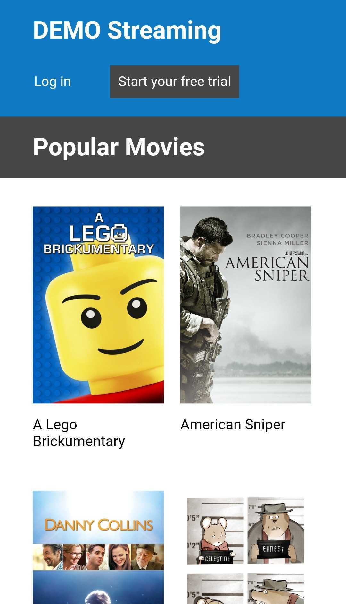

# DEMO Streaming

[DEMO Streaming](https://auddia-hayley.surge.sh/) provides a list of popular, new movies and series.

It was created for the [Auddia Coding Challenge](https://github.com/hayleyw7/auddia-react-coding-challenge).

## Reflections

### How did you decide on the technical and architectural choices used as part of your solution?

I chose Cypress for testing, because it works seamlessly to test what is rendered on the DOM.

I created large number of specific components to provide space for the project to grow and remain organized with time.

I sorted the files in very specific ways, as well, so that the code is easier to navigate and more in line with code bases to which I've previous contributed.

I implemented Router to change URLs between pages, because the code is simple to use and understand, and it allows the user to favorite pages and use the back button.

I used Lighthouse, because I want every project I make to score 100% on accessibility, and that is a quick, easy, well-regarded way to gauge it. This is why I went darker with the header bar after completing the project and screenshotting it, because I needed a higher contrast ratio to reach its best. The site scores 100 on all 3 pages: home, movies, and series.

### Are there any improvements you could make to your submission?

I would love to dry up the code and use more dynamic functions, as well as improve the CSS.
### What would you do differently if you were allocated more time?

I would really have liked to learn and implement hooks. 

I would update screenshots to reflect the darker header after using a Lighthouse report.

## Languages and technology

Utilizes JavaScript, React, CSS, HTML/JSX, NPM, Node, Cypress, Router, & Surge

Built with Visual Studio Code

[Code stored on GitHub](https://github.com/hayleyw7/auddia)

## Access and use website

Visit the site [here](https://auddia-hayley.surge.sh/).

When opening the home page, the user will see a header, a footer, and two tiles: "SERIES" and "MOVIES".

Depending on which of the two tiles they choose, they will either be taken to a page for series or movies, where they can alphabetically view the posters and titles of 21 releases newer than 2013.

## Screenshots

### Desktop

  
  
  

### Mobile

  
  
  

## Future additions

* A neat addition would be to allow the user to "favorite" movies.

## Contributors

Project completed by [Hayley Witherell](https://github.com/hayleyw7)

Project designed by [Luis Metzger](https://github.com/luismetzger/)